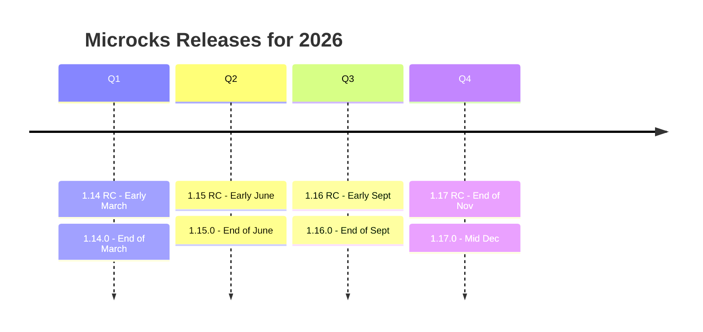
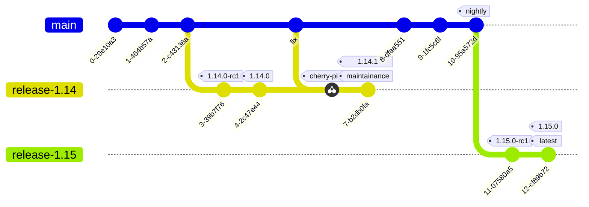
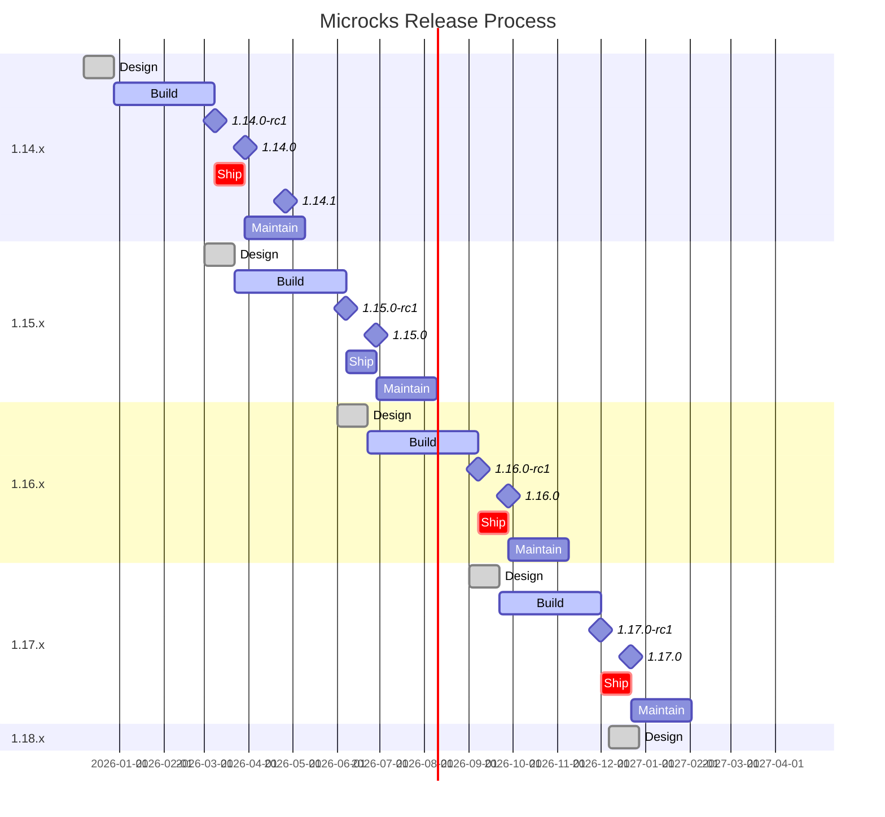

# Release Cycle and Cadence

The Microcks project aims to release four updates per year, typically one each quarter (every three months).

> Here's below a typical implementation for 2026.

This cadence provides a balance between regular feature releases and bug fixes, giving end users time to adopt a release and providing contributors clarity on releases they can contribute towards. By having a regular “train” of releases end users and contributors can plan ahead.

Although this is the desired candence, imbalance between scope and availability of contributors and maintainers might impact the number of releases in a given year. Maintainers might decide to reduce the number of releases in order to have more time to finish high priority improvements.

## Versioning, tagging and branching

All release artifacts must follow [Semantic Versioning](https://semver.org). Each release milestone increments the minor version. In exceptional cases, the major version can be increased too.

At code freeze of a release milestone, the `master` (or `main`) branch is forked into a branch named `release-<MAJOR>.<MINOR>`, which lives forever. To trigger a release candidate or a release, tagging should happen in the corresponding release branch. For example, to release version `1.14.0`, the tag `1.14.0` must be cut out of the `release-1.14` branch.

Hotfixes should be applied directly on `master` (or `main`) branch and then reported via cherry-picking into each of the impacted release branches, depending on the lifecycle policy (see below).

The Git graph below illustrates this rules:

Ideally, a release should be 100% automated and require only the tag to be pushed upstream.

## Release milestone

The Microcks project is under continuous development addressing issues for both bugs on existing features and new features. Features go through a lifecycle from proposal, design, code, test, docs, and often quickstart and other dependant repository deliverables. Feature proposals can be raised and reviewed by the community and maintainers at any time. 

Microcks is an open source and agile project, with feature planning and implementation happening at all times. Given the project scale and globally distributed developer base, it is critical to project velocity to not solely rely on a stabilization phase and rather have continuous integration testing which ensures the project is always stable so that individual commits can be flagged as having broken something. This includes continuous feature tests suites, performance tests and end-to-end testing for integration.

Each release goes through 4 phases:
  * `Design` phase is 3 weeks long
  * `Build` phase is 10 weeks long
  * `Ship` phase is 3 weeks long
  * `Maintain` phase is 6 weeks long

To be flexible enough, we define the following needs of parallelism between phases:  
  * `Design` phase of next release might start just before the `Ship` phase of the previous one. Thus, we can decide if a non-ready feature needs to be split or reported on the next release,
  * `Maintain` phase occurs during the `Build` phase of the next release. Producing a new release during the maintenance phase is not mandatory (depends on fix or CVE criticity), and the choice can be made to integrate into the `Build` of the next release.

Overall, this can be illustrated with the following Gantt diagram for the 2026 releases:

Most significant features take at least 2 releases to become included in a release, and through the preview feature process often more. Therefore as a release comes to a close, it is not unusual to move a complex feature to the next milestone to give it time to complete the requirements of the feature lifecycle.

### Release team

At the start of a milestone a release team is chosen. The release team has the responsibility of enforcing processes to ensure the release is successfully delivered. The release team consists of the following roles:

-	**Release lead.** This role oversees enforcing the processes for a release and ensuring communication to all contributors and community on the ongoing status of the release. This role requires to have at least been a release team shadow previously.
-	**Release lead shadow(s).** This role is identical to the lead and is interchangeable. The only difference is that the lead can delegate activities to the shadow to share distribution of work. There needs to be at least one shadow for a release, preferably two.
-	**Release test lead.** This role is responsible for overseeing the continuous monitoring of the CI builds, end-to-end tests, ensuring new tests are added for new features in this release.
-	**Build manager.** This role applies in the `Ship` and `Maintain` phase and is responsible for creating the RC releases, the final build/testing and release branches.
  
On assignment, the release team lead and shadow(s) are included into the Github release team group. They are responsible for;
- [ ] Creating and updating a milestone tracking issue with the proposed delivery dates.
- [ ] Communicating status to the community on an on-going basis.

### Design phase definition (~ 3 weeks)

`Design` phase is the moment we refine the backlogs and pick features or enhancements we plan to release in a version. In this phase, a set of feature proposals and significant design changes to existing features are reviewed where contributors are able to dedicate time to completing the issue or starting an issue for a future release.

For a feature to be considered for selection it must have a feature proposal issue, tagged appropriately. The proposal must include:
- [ ] A design in an implementable state that is reviewed and commented by maintainers and code owners
- [ ] A test plan and a Sponsor (ie. a user/adopter that will provide feedback during the `Build` phase)
- [ ] A linked open issue for the current milestone (if the design was discussed into a GitHub Discussion or Discord)

Maintainers are responsible for triaging issues into the milestone in this phase.

#### Communication & meetings

The bi-weekly Community Meeting is the privileged channel to discuss feature proposals and issues that different users would like to see in this release. This is to enable discussions on issues raised on Discord especially on priorities and scenarios. It is not intended for deep design discussion, which should be held separately and updated into the proposal.

The Discord channels from the "Project Area", specific to each project theme (ex: `#core`, `#testcontainers`, `#kubernetes`) must be used to discuss feature proposals and issues.

During this phase the **release lead** is responsible for:

- [ ] Posting on the Discord `#announcements` channel the start of the milestone and the `Design` phase
- [ ] Lead discussions during the Community Meetings

#### Phase check-list

At the conclusion of this phase, the **release lead**, working with maintainers and contributors, is responsible for;

**Adding to the milestone tracking issue:**
  - [ ] Any notes on specific goals for the release (for example focus on completing OpenAPI support)
  - [ ] The list of milestone issues for feature proposals and significant design changes to existing features
  - [ ] Will any preview features be made stable in this release?
  - [ ] Will alpha APIs be made stable in this release?

- [ ] Each maintainer acknowledges this to the release lead.
- [ ] Communicating the final decisions for this release on Discord channels. 

### Build phase definition (~ 10 weeks)

`Build` phase is the moment where contributors and volunteers develop, test, and document changes. This is the feature implementation and bug fixing phase and culminates in a code freeze period. During this phase, maintainers and code owners do continuous triages on their repos assigning or removing issues from the milestone and communicating any decisions that may affect other repos. It is recommended to triage on the Monday before the Community Meeting on Thursday.

#### Communication & meetings

The Discord channels from the "Project Area", specific to each project theme (ex: `#core`, `#testcontainers`, `#kubernetes`) or the draft PRs are the privileged chanels to discuss feature implementation and issues.

During this phase the **release lead** is responsible for:

- [ ] Seeking for updates from the maintainers and contributors involved in milestone issues
- [ ] Lead discussions during the Community Meetings

#### Phase outcomes

Members of the release team may remove issues from the milestone if the maintainers determine that the issue is not actually blocking the release and is unlikely to be resolved in a timely fashion. Members of the release team may remove PRs from the milestone for any of the following, or similar, reasons:

* PR is potentially destabilizing and is not needed to resolve a blocking issue.
* PR is a new, late feature PR and has not gone through the feature process
* There is no responsible contributor willing to take ownership of the PR and resolve any follow-up issues with it
* PR is not correctly labeled
* Work has visibly halted on the PR and delivery dates are uncertain or late

### Ship phase definition (~ 3 weeks)

`Ship` phase is the stabilization phase (eg. code freeze) when we prepare the release.

After code freeze, only critical bug fixes are accepted into the release codebase.

All features going into the release must be code-complete, including tests, and have docs PRs open. The docs PRs don't have to be ready to merge, but it should be clear what the topic will be and an owner is assigned. It’s incredibly important that documentation work gets completed as quickly as possible.

There are approximately three weeks following Code Freeze, and preceding final release, during which all remaining critical issues must be resolved before release. This also gives time for documentation finalization.

#### Communication & meetings

At code freeze the **release lead** is responsible for;

- [ ] Announcing on the Discord `#announcements` channel the code freeze.
- [ ] Create a "Release" type issue that listed all the remaining tasks before and during the release process.
- [ ] If needed, tells maintainers to create repo specific endgame issues.

During the three weeks of the `Ship` phase, the **build manager** is in charge to track the "Release" type issue and to coordinates with the **release lead**, the **release tests lead**, and the maintainers to evaluate if and when to build new Release Candidates packages.

- [ ] Each RC build is announced on the `#announcements` Discord channel to inform the community for validation testing.

- [ ] Final build is announced on the `#announcements` Discord channel to inform the community for update.

#### Phase outcomes

As soon as possible after the code freeze, we aim to provide a release candidate in the form of a `<MAJOR>.<MINOR>.0-RC1` tagged package. 

At the end of the `Ship` phase, and after all the tasks list in the "Realease" type issue are done, the **build managed** produce the final release package.

The **release lead** writes and publishes a release blog post on [Microcks.io](https://microcks.io) - see [1.13.0 release post](https://microcks.io/blog/microcks-1.13.0-release/) as an example.

Social network posts are schedule accordingly and the **release lead** is expected to present the final content into the next Community Meeting.

### Maintain phase definition (~ 6 weeks)

`Maintain` is the phase during which maintainers may produce bug fixes (either for features or for CVE). The release team for a given release remains on point for all future patch releases for that release.

Packages produced during this phase are versioned with `<MAJOR>.<MINOR>.N` tagged package. A new pathed version must be build if one of those criteria is met:

* Is it a fix for a functionnal feature aimed to be delivered in previous `Ship` phase?
* Is it a fix for a regression that appeared during current release?
* Is it a fix for a Critical vulnerability - rated with a CVSS score of 9.0 to 10.0?

#### Communication & meetings

At path version decision, the **release lead** is responsible for;

- [ ] Announcing on the Discord `#announcements` channel the pacth version release date

#### Phase check-list

If a patch is needed then the **release lead**:

- [ ] Creates a hotfix checklist issue and assigns owners to tasks
- [ ] Assigns a contributor(s) to fix the issue(s)
- [ ] The **build manager** is responsible for releasing the patch
- [ ] Announcing the patch availability on the Discord `#announcements` channel