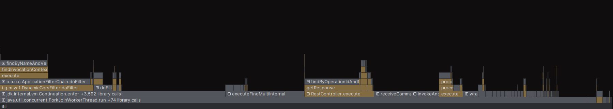
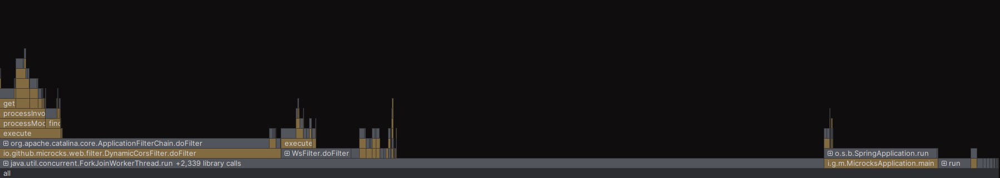
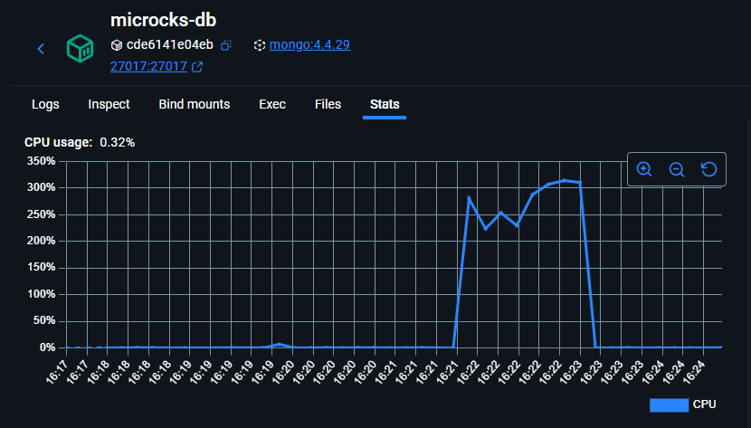
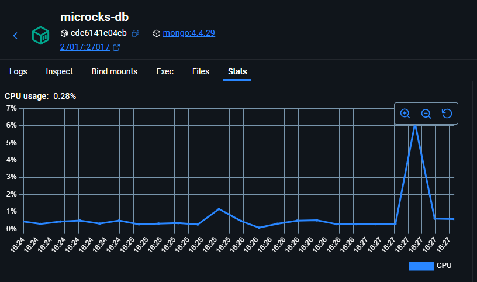

# Microcks Caching Performance Report (feat/add-caching based on 1.12.x)

This document consolidates the motivation for adding application-level caching to Microcks. It also includes quantified results, visual evidence and reproduction steps.

## Why

- Latency and throughput: Under load, REST and GraphQL mock invocations were DB-bound. Reducing read-path database calls promised lower latency and higher throughput.
- Cost and stability: Offloading repeated reads from MongoDB cuts CPU usage, reduces contention, and leaves more headroom under spikes.
- Observability evidence: Baseline flamegraphs show controller time dominated by repository lookups; MongoDB CPU was sustained high throughout the test.

## What changed

- Introduced Spring Cache with the Caffeine provider to cache hot read paths in the application layer.
- A/B toggle via configuration only, no code changes required to switch behavior:
  
  ```properties
  # Enable caching
  spring.cache.type=caffeine

  # Disable caching
  spring.cache.type=NONE
  ```

- Scope: Cache is applied to idempotent, read-mostly paths exercised by the benchmark (common REST/GraphQL mock responses and supporting lookups).
- Note: Caffeine is an in-memory, per-instance cache. Entries do not survive pod restarts and are not shared across pods.

## How we measured

- Tool: k6 running `benchmark/bench-microcks.js`.
- Scenarios:
  - REST: 40 VUs × 2,000 iterations each
  - GraphQL: 20 VUs × 1,000 iterations each
- Total workload: 100,000 iterations producing 380,000 HTTP requests.
- Logging: application logs were set to ERROR in the Logback configuration (INFO/DEBUG disabled) to eliminate logging I/O overhead during benchmarks.
- Only variable toggled between runs: `spring.cache.type` (NONE → caffeine).
- All checks passed (100%) in both runs.

## Results summary

Quantified improvements before vs after enabling caching:

| Metric                      | Before (NONE) | After (caffeine) |                  Delta |
|-----------------------------|--------------:|-----------------:|-----------------------:|
| Avg http_req_duration       |      10.87 ms |          2.56 ms | −76.4% (≈4.25× faster) |
| p90 http_req_duration       |      15.68 ms |          5.03 ms |         −67.9% (≈3.1×) |
| p95 http_req_duration       |      17.67 ms |          7.52 ms |        −57.5% (≈2.35×) |
| Avg TTFB (http_req_waiting) |      10.76 ms |          2.29 ms |         −78.7% (≈4.7×) |
| Iteration duration (avg)    |      42.03 ms |         11.21 ms |        −73.3% (≈3.75×) |
| Throughput (http_reqs/s)    |         4,245 |           13,731 |         +223% (≈3.23×) |
| Time to complete 100k iters |       1m29.5s |            27.7s |        −69.1% (≈3.23×) |
| HTTP failures               |             0 |                0 |                      — |

Key takeaways: Enabling Caffeine yields 3.2–4.7× latency improvements and ~3.2× higher throughput under this workload, with no errors.

## Visual evidence

- CPU flamegraphs
  - Before: `benchmark/before-flamegraph.png` — hot path dominated by repository lookups (e.g., `findByOperationIdAndDispatchCriteria`, `findByNameAndVersion`, `executeFindMultiInternal`), indicating DB-bound requests.
  - After: `benchmark/after-flamegraph.png` — DB-heavy stacks largely absent; time shifts to filter chain and response serialization, consistent with cache hits serving responses.

  

  

- MongoDB CPU
  - Before: `benchmark/microcks-db-before.png` — sustained high utilization during the test, peaking around 300%+ CPU (multi-core).
  - After: `benchmark/microcks-db-after.png` — near-idle (<1%) with only a brief warm-up spike (<7%).

  

  

Interpretation: Caching removed the majority of read-path DB work;

## Configuration and (recommended) tuning

- Toggle:
  - Enable: `spring.cache.type=caffeine`
  - Disable: `spring.cache.type=NONE`
- Recommended starting point for Caffeine (adjust to your data shape and memory budget):

  ```properties
  # Example only — validate for your deployment
  spring.cache.cache-names=mockResponses
  spring.cache.caffeine.spec=maximumSize=10000,expireAfterWrite=60s,recordStats
  ```

## Reproduce the benchmark

Prereqs: k6 installed; sample data loaded (as per repo samples). From the `benchmark` folder:

```bash
# Baseline (no cache)
java -Dspring.cache.type=NONE -Dkeycloak.enabled=false -jar ./webapp/target/microcks-app-1.12.2-SNAPSHOT-exec.jar
```
```bash
k6 run .\bench-microcks.js
```

```bash
# With caching (Caffeine)
java -Dspring.cache.type=caffeine -Dkeycloak.enabled=false -jar ./webapp/target/microcks-app-1.12.2-SNAPSHOT-exec.jar
```
```bash
k6 run .\bench-microcks.js
```

Notes:
- The two runs above use the same script and data; only the cache type differs.
- Ensure server instances are in a steady state at the start of each run.

## Conclusion

With Caffeine enabled, Microcks demonstrates substantial performance gains under load: 3.2–4.7× lower latencies and ~3.2× higher throughput, while dramatically reducing MongoDB CPU utilization. Apply the listed mitigations (TTL/eviction, key design, memory limits, and metrics) to maintain correctness and predictable operations in multi-tenant, multi-pod environments.
