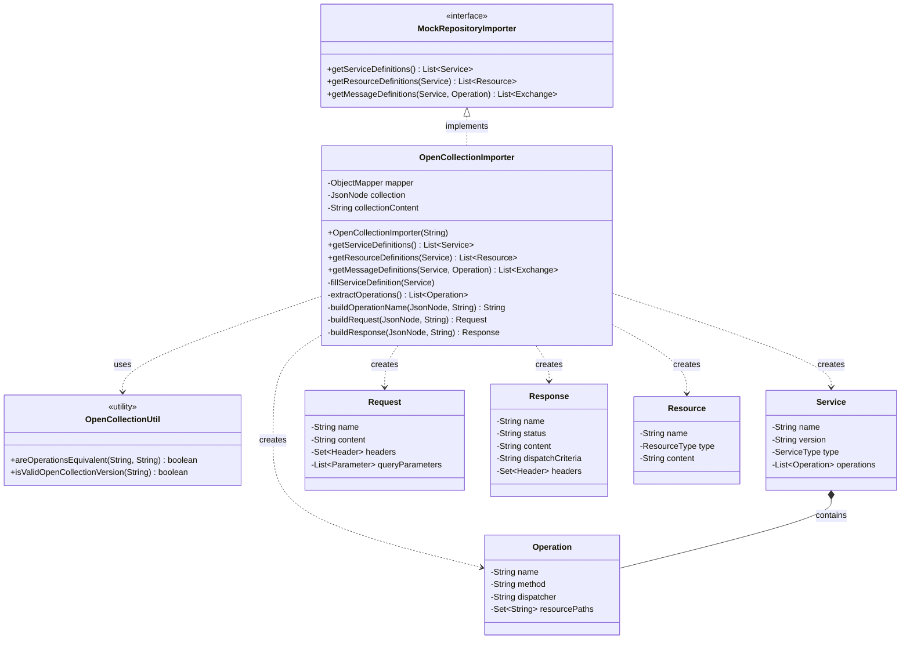
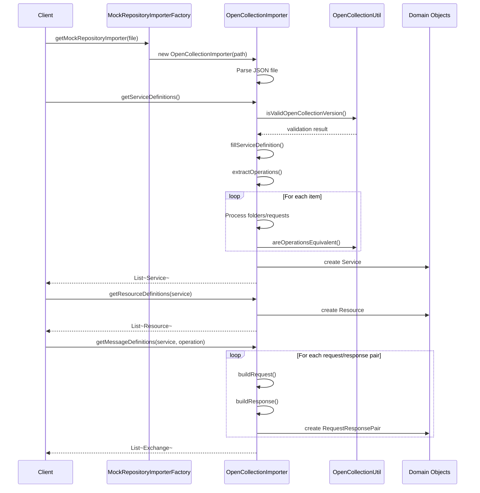

# OpenCollection Importer

This package provides support for importing OpenCollection format API definitions into Microcks.

## Architecture Overview



## Import Flow



## Class Responsibilities

### OpenCollectionImporter
**Purpose**: Main importer class that parses OpenCollection JSON files and converts them into Microcks domain objects.

**Key Responsibilities**:
- Parse OpenCollection JSON format (v1.x)
- Validate collection structure and version
- Extract service metadata (name, version, type)
- Build operations from request definitions
- Create request/response pairs with dispatch criteria
- Handle nested folder structures
- Support various HTTP methods (GET, POST, PUT, PATCH, DELETE)
- Extract headers, query parameters, path parameters, and body content

### OpenCollectionUtil
**Purpose**: Utility class providing helper functions for OpenCollection operations.

**Key Responsibilities**:
- Compare operation names for equivalence (handles different naming conventions)
- Convert between OpenAPI `{param}` and OpenCollection `:param` syntax
- Validate OpenCollection version strings
- Support case-insensitive operation matching
- Handle HTTP verb prefixes in operation names

## OpenCollection Format Support

### Supported Features
- ✅ OpenCollection v1.x format
- ✅ Service metadata (info, name, version)
- ✅ Folder organization (nested items)
- ✅ HTTP methods (GET, POST, PUT, PATCH, DELETE)
- ✅ Request headers
- ✅ Query parameters
- ✅ Path parameters (`:param` syntax)
- ✅ Request/response bodies
- ✅ Multiple response examples per request
- ✅ HTTP status codes
- ✅ Environment variables (stored as part of collection)

### Usage Example

```java
// Create importer
OpenCollectionImporter importer = 
    new OpenCollectionImporter("path/to/collection.json");

// Extract service definitions
List<Service> services = importer.getServiceDefinitions();
Service service = services.get(0);

// Get resources (original collection)
List<Resource> resources = importer.getResourceDefinitions(service);

// Get request/response examples for each operation
for (Operation operation : service.getOperations()) {
    List<Exchange> exchanges = 
        importer.getMessageDefinitions(service, operation);
}
```

## Integration Points

### MockRepositoryImporterFactory
The `OpenCollectionImporter` is registered with the factory and automatically selected when:
- File contains an `"opencollection"` field with version "1.x"
- File structure matches OpenCollection schema

### Resource Types
Collections are stored as `ResourceType.OPEN_COLLECTION` for later retrieval and display.

### Dispatch Criteria
Supports multiple dispatch styles:
- `URI_PARAMS` - Query parameter-based routing
- `URI_PARTS` - Path parameter-based routing
- `URI_ELEMENTS` - Combined path and query parameter routing

## Testing

Unit tests are located in:
- `OpenCollectionImporterTest.java` - Tests import functionality
- `OpenCollectionUtilTest.java` - Tests utility functions

Test fixtures:
- `sample-rest-api.json` - Main test collection with pastry API examples
- `invalid-version.json` - Tests version validation
- `missing-version.json` - Tests error handling
