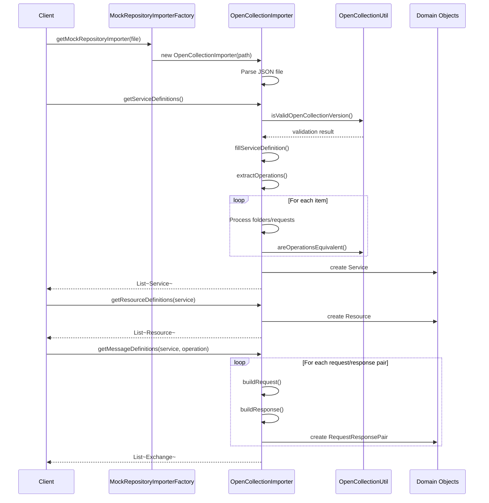

# OpenCollection Importer

This package provides support for importing OpenCollection format API definitions into Microcks.

## Architecture Overview

## Import Flow



## Class Responsibilities

### OpenCollectionImporter
**Purpose**: Main importer class that parses OpenCollection JSON files and converts them into Microcks domain objects.

**Key Responsibilities**:
- Parse OpenCollection JSON format (v1.x)
- Validate collection structure and version
- Extract service metadata (name, version, type)
- Build operations from request definitions
- Create request/response pairs with dispatch criteria
- Handle nested folder structures
- Support various HTTP methods (GET, POST, PUT, PATCH, DELETE)
- Extract headers, query parameters, path parameters, and body content

### OpenCollectionUtil
**Purpose**: Utility class providing helper functions for OpenCollection operations.

**Key Responsibilities**:
- Compare operation names for equivalence (handles different naming conventions)
- Convert between OpenAPI `{param}` and OpenCollection `:param` syntax
- Validate OpenCollection version strings
- Support case-insensitive operation matching
- Handle HTTP verb prefixes in operation names

#### Folder Support:

OpenCollection files support **nested hierarchical organization** of API requests through folders. Folders can contain other folders and requests in a tree structure, allowing you to organize your APIs logically.

**How it works**:
- Folders are represented by items with `type: "folder"` and contain nested `items` arrays
- The importer **recursively traverses** the folder structure through the `extractOperations()` method
- All requests are discovered and extracted regardless of nesting depth

**Example folder structure**:
```
Collection
  └── v1 APIs (folder)
       ├── Pastries (folder)
       │    ├── GET all pastries
       │    └── POST new pastry
       └── Users (folder)
            └── GET user by ID
```

This hierarchical organization helps keep large API collections maintainable while ensuring all endpoints are properly imported into Microcks.


## OpenCollection Format Support

### Supported Features
- ✅ OpenCollection v1.x format
- ✅ Service metadata (info, name, version)
- ✅ Folder organization (nested items)
- ✅ HTTP methods (GET, POST, PUT, PATCH, DELETE)
- ✅ Request headers
- ✅ Query parameters
- ✅ Path parameters (`:param` syntax)
- ✅ Request/response bodies
- ✅ Multiple response examples per request
- ✅ HTTP status codes
- ✅ Environment variables (stored as part of collection)


## Integration Points

### MockRepositoryImporterFactory
The `OpenCollectionImporter` is registered with the factory and automatically selected when:
- File contains an `"opencollection"` field with version "1.x"
- File structure matches OpenCollection schema

### Resource Types
Collections are stored as `ResourceType.OPEN_COLLECTION` for later retrieval and display.

### Dispatch Criteria
Supports multiple dispatch styles:
- `URI_PARAMS` - Query parameter-based routing
- `URI_PARTS` - Path parameter-based routing
- `URI_ELEMENTS` - Combined path and query parameter routing


## Similarities with Postman Implementation

The OpenCollection importer follows the same architectural pattern as the Postman importer (`PostmanCollectionImporter`), making it familiar and maintainable:

### Shared Design Patterns

| Aspect | OpenCollection | Postman | Notes |
|--------|---------------|---------|-------|
| **Interface** | Implements `MockRepositoryImporter` | Implements `MockRepositoryImporter` | Both use the standard three-phase import: services → resources → messages |
| **JSON Parsing** | Uses Jackson `ObjectMapper` | Uses Jackson `ObjectMapper` | Same parsing approach with `JsonNode` |
| **File Structure** | Reads from file path | Reads from file path | Both convert file bytes to JSON nodes |
| **Service Extraction** | `fillServiceDefinition()` | `fillServiceDefinition()` | Similar method for extracting service metadata |
| **Operation Building** | `extractOperations()` | `extractOperations()` | Both recursively traverse folder structures |
| **Folder Support** | Nested `items` array | Nested `item` array | Both support hierarchical organization |
| **Request/Response** | `buildRequest()`, `buildResponse()` | Similar builder methods | Both create request/response pairs |
| **Utility Class** | `OpenCollectionUtil` | `PostmanUtil` | Both have companion utilities for operation matching |
| **Operation Matching** | `areOperationsEquivalent()` | `areOperationsEquivalent()` | Identical method signature and purpose |
| **Path Parameters** | Converts `:param` syntax | Converts `:param` syntax | Both handle Postman-style path params |
| **Dispatch Criteria** | Supports URI_PARAMS, URI_PARTS, URI_ELEMENTS | Same dispatch styles | Identical routing strategies |
| **Resource Type** | `OPEN_COLLECTION` | `POSTMAN_COLLECTION` | Parallel resource type enums |

### Key Differences

| Feature | OpenCollection | Postman |
|---------|---------------|---------|
| **Version Field** | Required `opencollection` field | `_postman_id` marker |
| **Version Validation** | `OpenCollectionUtil.isValidOpenCollectionVersion()` | Checks for v2 collection flag |
| **Schema** | OpenCollection v1.x JSON schema | Postman Collection v2/v2.1 |
| **Item Type** | Explicit `type: "folder"` or `type: "request"` | Implicit (has `request` node or not) |
| **Parameters** | Single `params` array with `type` field | Separate `query`, `variable` nodes |


### Example Parallel Methods

```java
// Both importers follow this pattern:

// 1. Parse file
OpenCollectionImporter(String filePath) // OpenCollection
PostmanCollectionImporter(String collectionFilePath) // Postman

// 2. Extract service
fillServiceDefinition(Service service) // Both

// 3. Build operations
extractOperations() → List<Operation> // Both

// 4. Create messages
getMessageDefinitions(Service, Operation) → List<Exchange> // Both
```